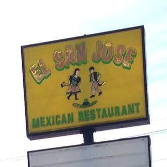

# El San Jose Mexican Restaurant



Official website for **El San Jose Mexican Restaurant**, serving authentic Mexican cuisine in Lake City, South Carolina.

## 🌮 About

El San Jose Mexican Restaurant is a family-owned establishment offering delicious Mexican food to the Lake City community.

**Address:** 275 W Main St, Lake City, SC 29560  
**Phone:** [(843) 394-5522](tel:18433945522)

### Hours of Operation

| Day       | Hours              |
|-----------|-------------------|
| Monday    | 11:00 AM - 10:00 PM |
| Tuesday   | 11:00 AM - 10:00 PM |
| Wednesday | 11:00 AM - 10:00 PM |
| Thursday  | 11:00 AM - 10:00 PM |
| Friday    | 11:00 AM - 10:30 PM |
| Saturday  | 11:30 AM - 10:00 PM |
| Sunday    | 11:30 AM - 9:30 PM  |

## 🔗 Links

- **Website:** [elsanjose.com](https://elsanjose.com)
- **Facebook:** [El San Jose Mexican Restaurant](https://www.facebook.com/p/El-San-Jo%C5%9Be-Mexican-Restaurant-100054416922443/)
- **Order Online:** [Uber Eats](https://www.ubereats.com/store/el-san-jose-lake-city-mexican/by2_YlwRRI6HhDw6Dkeu7A)

## 🚀 Deploy

One repo → one Cloudflare Pages project (`elsanjose-com`, TGWAB account), deployed by the **Pages Git integration** on every push to `main`. No build step—the repo is the output; framework preset **None**. There is no other deploy path.

The canonical host is **`elsanjose.com`** (apex); `www.elsanjose.com` 301s to it.

1. Push changes to the `main` branch
2. Cloudflare Pages automatically deploys the site
3. Visit [elsanjose.com](https://elsanjose.com) to see the live site

## 📁 Project Structure

```
elsanjose.com/
├── index.html              # Main website page
├── 404.html                # Custom 404 error page
├── _headers                # Cloudflare Pages security headers (CSP etc.)
├── CNAME                   # Custom domain configuration
├── robots.txt              # Search engine crawling rules
├── sitemap.xml             # XML sitemap for SEO
├── sitemap-index.xml       # Sitemap index (advertised in robots.txt)
├── humans.txt              # Credits and acknowledgments
├── llms.txt                # Site summary for AI crawlers
├── ads.txt                 # Programmatic ad inventory declaration
├── site.webmanifest        # Web app manifest
├── favicon.ico             # Favicon (16/32/48)
├── apple-touch-icon.png    # Apple touch icon (180x180)
├── icon-192.png            # PWA icon (192x192)
├── icon-512.png            # PWA icon (512x512)
├── icon-512-maskable.png   # PWA maskable icon (512x512)
├── LICENSE                 # MIT License
├── README.md               # This file
├── .well-known/
│   └── security.txt        # Security policy
└── assets/
    ├── main.min.css        # Optimized stylesheet
    ├── main.min.js         # Optimized JavaScript
    ├── noscript.css        # Styles for no-JS browsers
    └── images/             # Image assets
        ├── gallery01/      # Menu images
        └── gallery02/      # Restaurant photos
```

## 🛠️ Technical Details

- **Type:** Static HTML website
- **CSS:** Optimized CSS with CSS variables and responsive design
- **JavaScript:** Vanilla JS with gallery lightbox, scroll animations, and slideshow
- **Fonts:** Playfair Display & Inter (Google Fonts)
- **Hosting:** Cloudflare Pages
- **SSL:** Enabled via Cloudflare

### Performance Optimizations

| Asset | Original | Optimized | Reduction |
|-------|----------|-----------|-----------|
| CSS   | 88KB (3,466 lines) | 36KB (392 lines) | 59% smaller |
| JS    | 95KB (4,244 lines) | 31KB (822 lines) | 67% smaller |

## 📋 Web Standards Compliance

This website includes:

- ✅ `robots.txt` - Search engine directives
- ✅ `sitemap.xml` + `sitemap-index.xml` - XML sitemaps for SEO
- ✅ `humans.txt` - Team credits
- ✅ `llms.txt` - Site summary for AI crawlers
- ✅ `ads.txt` - Programmatic ad inventory declaration
- ✅ `security.txt` - Security contact info
- ✅ `site.webmanifest` - Web app manifest with icons
- ✅ `404.html` - Custom error page
- ✅ `_headers` - Security headers with a strict Content-Security-Policy
- ✅ Open Graph meta tags
- ✅ Responsive viewport meta tag
- ✅ Semantic HTML5

## 📋 Standards

Built to the TGWAB Dev Standards **v2.19.0** (internal). Client property, **Fully managed** tier—the product-facing sections (§1 branding, §10 link-backs, §17 launch checklist) do not apply.

### Deviations

- §2—Astro + Tailwind stack—hand-authored static site inherited from the client's pre-standards build—2026-08-04—permanent
- §2—no runtime CDNs—Playfair Display & Inter still load from Google Fonts; self-hosting the woff2 files is the open follow-up—2026-08-04—review 2026-11-01
- §11—generated sitemap—no build step on this site, so `sitemap.xml` is maintained by hand—2026-08-04—permanent
- §14—dark mode legibility—site is light-only by client design (`color-scheme: light only`)—2026-08-04—permanent

## 📝 [License](LICENSE)

Created with ❤️ by [Michal Ferber](https://michalferber.dev/), aka [TechGuyWithABeard](https://techguywithabeard.com/)
